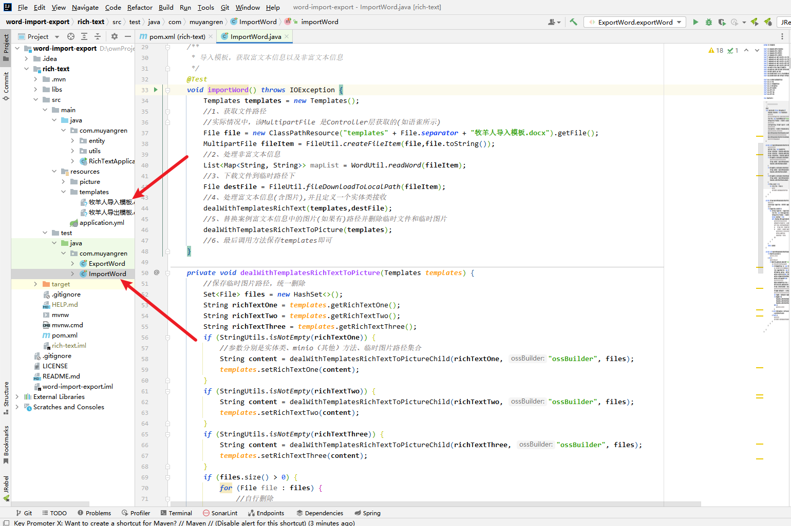
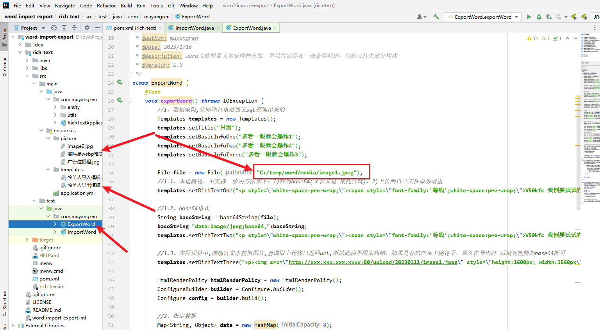

java实现word导入导出富文本(含图片)-附完整测试用例

主要有以下几点：
1、解决富文本导入导出依赖兼容问题。
2、处理富文本和非富文本内容
3、解决webp格式通过java下载不了问题，如果要用到富文本导出，将来势必是会碰到的bug，这里提前提出来并解决，resource路径下有提供webp格式图片进行测试。
    4、在原有方法上优化，比如处理等比缩小图片、将图片本地路径，替换为minio或者其他

参考文献:
https://github.com/draco1023/poi-tl-ext

本人环境
jdk8+maven3.3.9

如果觉得有帮助麻烦点个星支持下

启用步骤
1、如图加载依赖

2、看导入模板，在debug看一下获取参数情况

3、看导出模板

如图所示
将图片放在桌面位置，并且修改代码中的路径即可看到效果